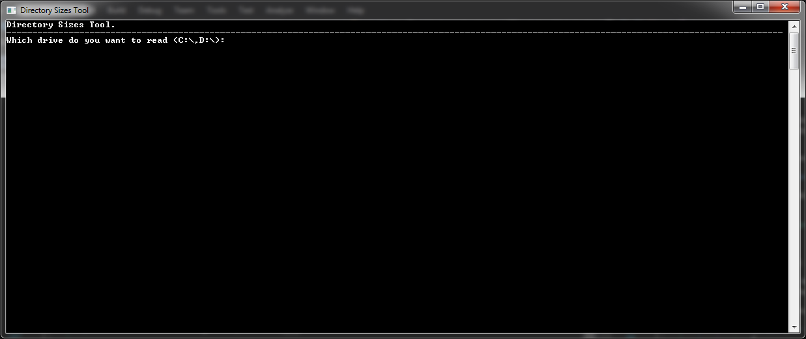
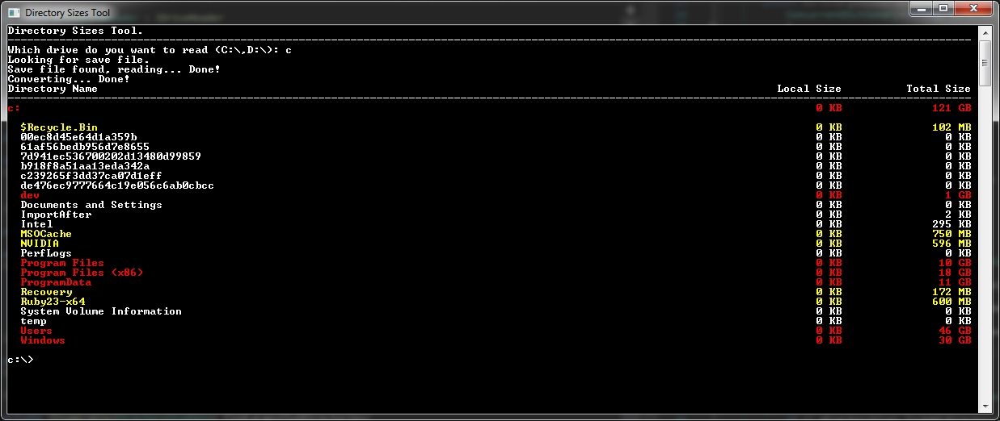
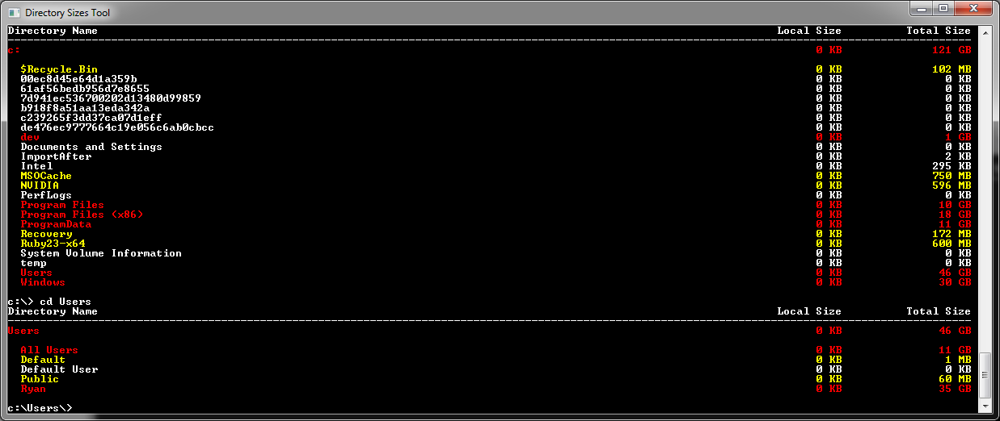
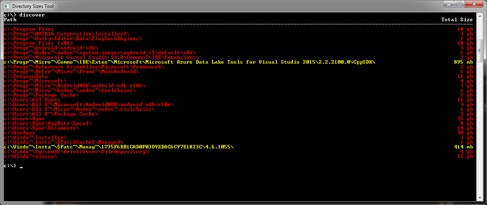
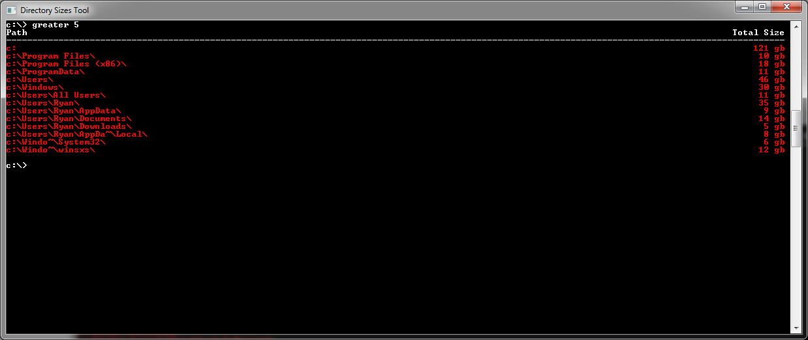
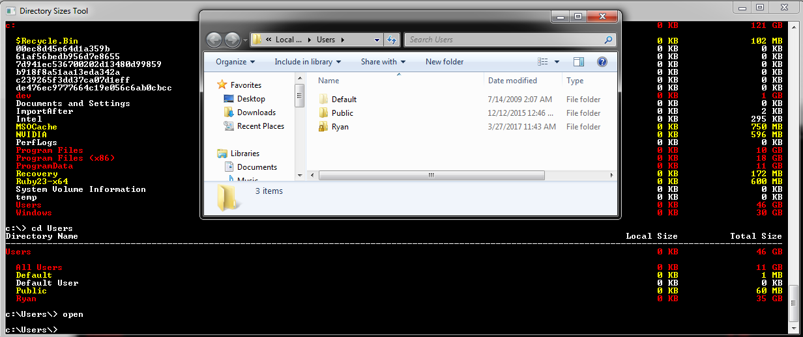

# DirectorySizesTool
A Tool to help identify large directories in Windows.

This tool can help you find large directories that you may not know about, such as albums of music or pictures that are taking up a lot
of space.
Instead of having to manually navigate through Windows directories and check their sizes, this tool compiles all of the directory sizes
for you and displays them in a nice highlighted list.

When first running the application, it will ask for a drive, and then will read the entered drive, save the data to disk, and display the root directory.

Commands that can be used after reading a drive are (*optional parameter):
- <strong>cd</strong> <i>[subdirectory name]</i> - navigate to a subdirectory in the current directory, or use .. to navigate up.
- <strong>discover</strong> <i>[*percent threshold]</i> - discover large directories based on a percent threshold against the parent directory. Defaults to
5%;
- <strong>greater</strong> <i>[size] [*b/kb/mg/gb]</i> - find all directories larger than [size]. Defaults to gb.
- <strong>open</strong> <i>[path]</i> - opens the current directory in Windows Explorer.
- <strong>quit</strong> - Exits application.
- <strong>read</strong> <i>[drive letter]</i> - reads a drive, either directly or from a previous file.

<strong>Examples</strong>

- cd

- discover

- greater

- open

